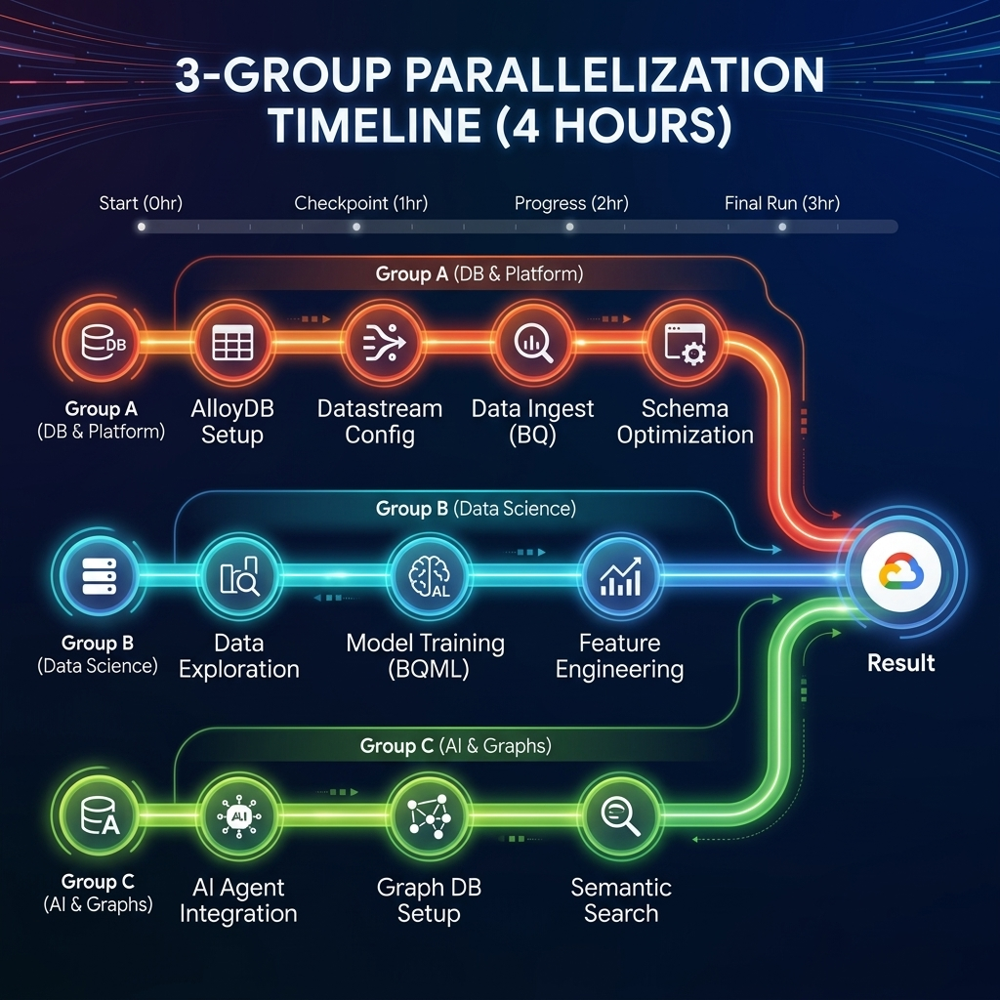
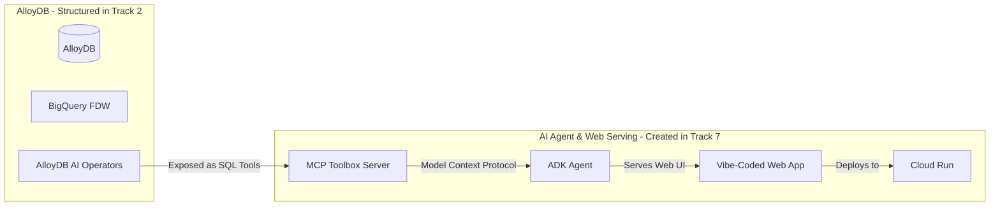

# Disneyland Agentic Data Cloud gHack

## Introduction

Welcome, Disney Data Wizards! 🪄

Planning the perfect Disneyland trip is a complex optimization problem. Visitors want to maximize magic and minimize waiting. They want to know: *Which rides are best suited for them? When are the crowds thinnest? What is the optimal route through the park to avoid bottleneck queues?*

In this gHack, your mission is to transform raw data—visitor reviews, attraction catalogs, historical wait times, park brochures, and visitor movement logs—into an end-to-end, intelligent guest assistance system.

This gHack is designed to be highly challenging and is structured into **7 tracks** that can be parallelized across **3 key team personas** to optimize development speed:
*   **DB & Platform Engineers** will build the operational database in AlloyDB, configure Datastream replication, set up the database agentic layer (MCP Toolbox), and assemble the final ADK agent and web UI on Cloud Run (Tracks 1, 2, and 7).
*   **Data Scientists & Analysts** will train predictive models, perform sentiment analysis, cluster attractions in BigQuery, and design the semantic layer/Conversational Analytics agent for park managers (Tracks 3 and 6).
*   **AI & Graph Engineers** will construct RAG pipelines, classify multimodal images, and model/query visitor movement patterns using property graphs in BigQuery (Tracks 4 and 5).

Get ready to build an agentic data pipeline that would make Mickey proud! Let the magic begin! ✨


## 👥 Team Roles & Parallelization Paths

This gHack is designed to be highly challenging but is **fully parallelizable** across different team members. Whether you are a team of 2, 3, or more, you can split the tracks to build in parallel and assemble a complete intelligent system in under 4 hours.

### 📊 Recommended Parallelization Options

Here is how you can divide and conquer based on your team size:



#### 🧩 Option 1: The 3-Group Split (Recommended)
*   **Group A (Platform & DB Engineers):** Focuses on the core transactional and serving loop.
    *   *Path:* [Track 1](file:///Users/cornillon/Documents/git/gHack_datacloud_2026/new_instructions.md#track-1-data-foundation-operational-to-analytical) -> [Track 2](file:///Users/cornillon/Documents/git/gHack_datacloud_2026/new_instructions.md#track-2-exposing-alloydb-via-querydata-mcp-toolbox-database-agentic-layer) -> [Track 7](file:///Users/cornillon/Documents/git/gHack_datacloud_2026/new_instructions.md#track-7-building-the-real-time-guest-assistant)
*   **Group B (Data Scientists):** Focuses on analytics, forecasting, and clustering.
    *   *Path:* [Track 3](file:///Users/cornillon/Documents/git/gHack_datacloud_2026/new_instructions.md#track-3-data-science-ml-predictive-sentiment) -> Assist Group C with [Track 6](file:///Users/cornillon/Documents/git/gHack_datacloud_2026/new_instructions.md#track-6-conversational-analytics-the-internal-ai-analyst) or Group A with [Track 7](file:///Users/cornillon/Documents/git/gHack_datacloud_2026/new_instructions.md#track-7-building-the-real-time-guest-assistant)
*   **Group C (AI & Graph Engineers):** Focuses on unstructured data, graphs, and internal conversational search.
    *   *Path:* [Track 4](file:///Users/cornillon/Documents/git/gHack_datacloud_2026/new_instructions.md#track-4-multimodal-rag-analytics) -> [Track 5](file:///Users/cornillon/Documents/git/gHack_datacloud_2026/new_instructions.md#track-5-graph-analytics-visitor-movement) -> [Track 6](file:///Users/cornillon/Documents/git/gHack_datacloud_2026/new_instructions.md#track-6-conversational-analytics-the-internal-ai-analyst)

#### 👥 Option 2: The 2-Group Split
*   **Group A (Database & Application Developers):** Focuses on database setup, agentic tool serving, and app integration.
    *   *Path:* [Track 1](file:///Users/cornillon/Documents/git/gHack_datacloud_2026/new_instructions.md#track-1-data-foundation-operational-to-analytical) -> [Track 2](file:///Users/cornillon/Documents/git/gHack_datacloud_2026/new_instructions.md#track-2-exposing-alloydb-via-querydata-mcp-toolbox-database-agentic-layer) -> [Track 7](file:///Users/cornillon/Documents/git/gHack_datacloud_2026/new_instructions.md#track-7-building-the-real-time-guest-assistant)
*   **Group B (AI, ML & Analytics Engineers):** Focuses on all BigQuery-centric analytics, ML models, RAG, and property graphs.
    *   *Path:* [Track 4](file:///Users/cornillon/Documents/git/gHack_datacloud_2026/new_instructions.md#track-4-multimodal-rag-analytics) -> [Track 3](file:///Users/cornillon/Documents/git/gHack_datacloud_2026/new_instructions.md#track-3-data-science-ml-predictive-sentiment) -> [Track 5](file:///Users/cornillon/Documents/git/gHack_datacloud_2026/new_instructions.md#track-5-graph-analytics-visitor-movement) -> [Track 6](file:///Users/cornillon/Documents/git/gHack_datacloud_2026/new_instructions.md#track-6-conversational-analytics-the-internal-ai-analyst)

---

### ⚡ Parallelization Secret Weapons (Avoid Bottlenecks)

To prevent teams from blocking each other, utilize these coordination strategies:

1.  **Zero-Delay BigQuery ML & Graph Analytics (Bypass Track 1):**
    Group B and C do not need to wait for Group A's Datastream replication to be active. They can immediately load the raw CSV files (`reviews.csv`, `attractions.csv`, `visitor_movements.csv`, and `waiting_times.csv`) from Cloud Storage directly into BigQuery at the very beginning of the gHack to start training their models and building graphs.
2.  **Instant FDW Mapping (Bypass Track 3 & 5):**
    Group A does not need to wait for Group B and C to complete their models to configure the BigQuery FDW in AlloyDB. At the start of Track 2, Group A can simply execute the following SQL commands in BigQuery to create empty placeholder tables. This allows the FDW mapping and the MCP server setup to succeed immediately:
    ```sql
    -- Run this in BigQuery to unblock FDW mapping in AlloyDB
    CREATE TABLE IF NOT EXISTS disney.forecasted_waiting_times (
        attraction_id INT64,
        forecasted_timestamp TIMESTAMP,
        predicted_wait_time FLOAT64
    );
    
    CREATE TABLE IF NOT EXISTS disney.graph_recommendations (
        attraction_id INT64,
        recommended_next_attraction_id INT64,
        congestion_level STRING
    );
    ```
    Once Group B and C complete their tracks, they will overwrite or append to these tables, and Group A's tools will automatically start returning live data!

---

## Track 1: Data Foundation (Operational to Analytical)
**Target Persona:** Data Engineer / DBA
**Estimated Duration:** 45 minutes

In this track, you will initialize the operational database, load the base data, generate embeddings at the source, and set up real-time replication to BigQuery.

### 1.1 Ingest Data into AlloyDB

First, let's connect to your **AlloyDB for PostgreSQL** cluster.

> [!TIP]
> **AlloyDB Postgres Credentials:**
> *   **Database:** `postgres`
> *   **Username:** `postgres`
> *   **Password:** `buildwithgemini2026`

Connect using **AlloyDB Studio** or `psql` and perform the following tasks:

1.  **Create the Tables:**
    *   **`disneyland_reviews`**: Represents visitor reviews.
        *   Columns: `review_id` (integer, Primary Key), `rating` (integer), `year_month` (text), `reviewer_location` (text), `review_text` (text), `branch` (text).
    *   **`disneyland_attractions`**: Represents the park's attractions.
        *   Columns: `attraction_id` (integer, Primary Key), `branch` (text), `name` (text), `description` (text).
2.  **Add a Full-Text Search Vector:**
    To enable high-performance hybrid search later, add a generated `tsvector` column to the attractions table:
    ```sql
    ALTER TABLE disneyland_attractions 
    ADD COLUMN description_tsvector tsvector 
    GENERATED ALWAYS AS (to_tsvector('english', description)) STORED;
    ```
3.  **Import Data from Cloud Storage:**
    Use the AlloyDB Import API (via UI or `gcloud`) or the tool of your choice to import the data from these public CSVs:
    *   `gs://gHack_data_disneyland_<YOUR_PROJECT_3DIGITS>/reviews.csv` into `disneyland_reviews`
    *   `gs://gHack_data_disneyland_<YOUR_PROJECT_3DIGITS>/attractions.csv` into `disneyland_attractions`

### 1.2 Generate Vector Embeddings at the Source

To support semantic searches on our attractions, we need to generate and store vector embeddings directly inside AlloyDB using **AlloyDB AI**.

1.  **Enable the Extensions:**
    ```sql
    CREATE EXTENSION IF NOT EXISTS vector CASCADE;
    CREATE EXTENSION IF NOT EXISTS google_ml_integration CASCADE;
    ```
2.  **Add the Embedding Column:**
    Add a vector column of size 3072 (the output dimension of `gemini-embedding-001`) to the attractions table:
    ```sql
    ALTER TABLE disneyland_attractions ADD COLUMN embedding vector(3072);
    ```
3.  **Generate Embeddings:**
    Populate the `embedding` column by calling Vertex AI's embedding model natively from SQL:
    ```sql
    -- TODO: Write an UPDATE query that populates the `embedding` column by calling 
    -- Vertex AI's embedding model natively from SQL using the 'gemini-embedding-001' model.
    ```

### 1.3 Set Up Real-Time Replication with One-Click Datastream

To stream our data from AlloyDB to BigQuery in near real-time, we will use **Google Datastream** via the **One-Click Datastream Integration**.

1.  **Create the Stream (One-Click Setup):**
    *   In the Google Cloud Console, navigate to **AlloyDB > Clusters**.
    *   Select your cluster, and look for the **Replicate to BigQuery** or **One-Click Datastream Integration** option.
    *   Follow the guided wizard. It will automatically detect your publication and replication slot, create the source profile, the destination profile, and start the stream.
    *   Ensure the target dataset is named **`disney`** and is located in the **`europe-west1`** (Belgium) region. Set the stream write mode to **Merge** and staleness limit to **0 seconds**.

### 1.4 Prove the Flow with Data Canvas

Once the stream is running, the data will begin replicating to BigQuery.
1.  Navigate to **BigQuery Studio**.
2.  Open **Data Canvas** (the new visual interface for exploring data).
3.  Load the replicated `disneyland_reviews` table.
4.  Create a quick visualization (e.g., a bar chart showing the average rating per branch) to verify the data is flowing correctly from AlloyDB.

> [!CAUTION]
> **Checkpoint:** To validate Track 1, you must show:
> *   The row counts of both tables in AlloyDB (`disneyland_reviews` should have ~20,000 rows, `disneyland_attractions` should have ~73 rows).
> *   The SQL query you used to generate the embeddings.
> *   A similarity search query in AlloyDB demonstrating the top 5 attractions similar to `'thrilling dark ride in space'`.
> *   A screenshot of your BigQuery Data Canvas showing a visualization of the replicated reviews.

---

## Track 2: Exposing AlloyDB via QueryData & MCP Toolbox (Database Agentic Layer)
**Target Persona:** DBA / Database Developer
**Estimated Duration:** 60 minutes
*Prerequisite: Track 1 must be completed.*

In this dedicated stream, you will establish the **agentic interface** directly on top of your operational database. This allows AI models to securely and deterministically translate natural language questions into database operations, and exposes those operations as standard MCP tools. 

To simplify security and credentials, the final ADK guest assistant agent built in Track 7 will only query AlloyDB (via the MCP Toolbox). All analytical insights (wait times, graph recommendations) will be accessed transparently by querying FDW-mapped foreign tables *inside* AlloyDB, keeping the agentic architecture secure, simple, and decoupled.

Because this stream can be run in parallel with the BigQuery analytical tracks, we will configure the schema connections and tool parameters for the analytical insights now (mapping them via FDW). When the analytical tracks are completed and write their data to BigQuery, these tools will automatically start returning live predictions and graph routings!

### 2.1 Bridge BigQuery Analytics to AlloyDB (BigQuery FDW)

Instead of setting up an active replication pipeline going backward (Reverse-ETL), we will implement a highly elegant, pull-based bridge using **BigQuery Foreign Data Wrapper (FDW)** inside AlloyDB. This allows AlloyDB to query the analytical tables in BigQuery on-demand with low latency.

1.  **Grant IAM Privileges to AlloyDB:**
    *   Run the following command to describe your AlloyDB cluster and locate its service account (`serviceAccountEmail`):
        ```bash
        gcloud beta alloydb clusters describe <CLUSTER_ID> --region=europe-west1
        ```
    *   In the Google Cloud Console (IAM page), grant this service account the following roles:
        *   **BigQuery Data Viewer** (`roles/bigquery.dataViewer`)
        *   **BigQuery Read Session User** (`roles/bigquery.readSessionUser`)
> [!TIP]
> **Recommendation:** Use the built-in SQL query editor and database schema explorer interface in **AlloyDB Studio** to run these configuration steps and verify that your foreign tables are correctly mapped in the schema tree.

2.  **Configure FDW in AlloyDB:**
    Connect to your `postgres` database in AlloyDB Studio. Create the `bigquery_fdw` extension, establish a foreign server named `bq_disney_server` utilizing the wrapper, and create a user mapping for the `postgres` user. 
    *(Refer to the Solutions Reference for the required DDL statements).*
3.  **Map the BigQuery Tables as Foreign Tables:**
    Create foreign tables in AlloyDB mapped directly to your analytical tables in BigQuery:
    *   **`bq_forecasted_waiting_times`**: Mapped to the BigQuery table `disney.forecasted_waiting_times` (columns: `attraction_id` int, `forecasted_timestamp` timestamp, `predicted_wait_time` numeric).
    *   **`bq_graph_recommendations`**: Mapped to the BigQuery table `disney.graph_recommendations` (columns: `attraction_id` int, `recommended_next_attraction_id` int, `congestion_level` text).

### 2.2 Set Up the QueryData Context Set in AlloyDB

To bring predictability and eliminate SQL hallucinations, you will configure **QueryData** templates. This maps common natural language questions about attractions and reviews to strict SQL structures.

1.  **Create the JSON Context Set File:**
    Create a file named `querydata_disney_context.json` on your local system. Fill in the SQL templates and queries according to the requirements:
    ```json
    {
      "templates": [
        {
          "nlQuery": "Show available attractions in Disneyland Paris",
          "sql": "/* TODO: Write SQL to select name, description from public.disneyland_attractions filtered by branch */",
          "intent": "List all attractions for a specific park branch",
          "manifest": "List attractions by branch",
          "parameterized": {
            "parameterized_intent": "Show available attractions in $1",
            "parameterized_sql": "/* TODO: Write the parameterized SQL using $1 */"
          }
        },
        {
          "nlQuery": "Find reviews with rating 5 for Space Mountain",
          "sql": "/* TODO: Write SQL to join reviews and attractions on branch, filtered by attraction name and rating */",
          "intent": "Get reviews with a specific rating for a named attraction",
          "manifest": "Get reviews by attraction and rating",
          "parameterized": {
            "parameterized_intent": "Find reviews with rating $2 for $1",
            "parameterized_sql": "/* TODO: Write the parameterized SQL using $1 (name) and $2 (rating) */"
          }
        },
        {
          "nlQuery": "Average rating of attractions in California Adventure",
          "sql": "/* TODO: Write SQL to select the average rating from public.disneyland_reviews filtered by branch */",
          "intent": "Calculate the average review rating for a specific branch",
          "manifest": "Average rating by branch",
          "parameterized": {
            "parameterized_intent": "Average rating of attractions in $1",
            "parameterized_sql": "/* TODO: Write the parameterized SQL using $1 */"
          }
        }
      ],
      "facets": [
        {
          "sql_snippet": "/* TODO: Write SQL snippet to filter rating >= 4 */",
          "intent": "highly rated reviews",
          "manifest": "Filter reviews by a minimum rating threshold",
          "parameterized": {
            "parameterized_intent": "reviews with rating greater than or equal to $1",
            "parameterized_sql_snippet": "/* TODO: Write the parameterized SQL snippet using $1 */"
          }
        }
      ],
      "value_searches": [
        {
          "query": "/* TODO: Write value search SQL query for public.disneyland_attractions.name (ILIKE $value) */",
          "concept_type": "Attraction Name",
          "description": "Search for attraction names"
        },
        {
          "query": "/* TODO: Write value search SQL query for public.disneyland_attractions.branch (ILIKE $value) */",
          "concept_type": "Branch Name",
          "description": "Search for park branches"
        }
      ]
    }
    ```
2.  **Upload Context Set to AlloyDB:**
    *   In the Google Cloud Console, open **AlloyDB Studio** connected to the `postgres` database.
    *   In the left sidebar, click **Context sets**.
    *   Click **Create context set**, name it `disney-context`, and upload the `querydata_disney_context.json` file.
    *   Validate the setup by using the **Test context set** feature with variations of your natural language templates.

### 2.3 Expose AlloyDB AI Operators

You will prepare SQL queries that leverage AlloyDB's advanced AI features (vector search and hybrid search) to expose them as tools.

1.  **Hybrid Search (ScaNN + FTS):**
    Ensure the indexes are created in AlloyDB:
    ```sql
    -- Index RUM for Keyword FTS
    CREATE INDEX IF NOT EXISTS attractions_tsvector_idx ON disneyland_attractions USING RUM (description_tsvector rum_tsvector_ops);
    
    -- Index ScaNN for Vector Cosine Similarity
    CREATE INDEX IF NOT EXISTS attractions_vector_idx ON disneyland_attractions USING scann (embedding cosine) WITH (num_leaves=10);
    ```
    This hybrid search capability will be mapped directly to an MCP tool.

2.  **Semantic Filtering (`ai.if`):**
    Create a SQL function to easily filter attractions based on natural language safety or suitability profiles:
    ```sql
    CREATE OR REPLACE FUNCTION filter_attractions_semantically(prompt_text TEXT, max_id INT)
    RETURNS TABLE(name TEXT, description TEXT) AS $$
      SELECT name, description 
      FROM disneyland_attractions 
      WHERE attraction_id <= max_id
        AND /* TODO: Add the google_ml.if operator logic here to filter descriptions semantically based on prompt_text */;
    $$ LANGUAGE SQL;
    ```

### 2.4 Scaffold the MCP Toolbox Server & Expose SQL Tools

You will now expose all these database capabilities (both operational tables and the BigQuery FDW analytical tables) using **MCP Toolbox for databases** so that they can be securely called by any downstream AI agent.

1.  **Install MCP Toolbox:**
    In your Cloud Shell terminal, download and make the toolbox executable:
    ```bash
    export VERSION=1.1.0
    curl -L -o toolbox https://storage.googleapis.com/mcp-toolbox-for-databases/v$VERSION/linux/amd64/toolbox
    chmod +x toolbox
    ```
2.  **Configure `tools.yaml`:**
    Create a `tools.yaml` file outlining all the operational and analytical tools:
    ```yaml
    kind: source
    name: disney-db
    type: alloydb-postgres
    project: "[YOUR_PROJECT_ID]"
    region: "europe-west1"
    cluster: "[YOUR_CLUSTER]"
    instance: "[YOUR_INSTANCE]"
    ipType: "public"
    database: "postgres"
    user: "postgres"
    password: "buildwithgemini2026"
    ---
    # Tool 1: Hybrid Search using ScaNN and Full-Text Search
    kind: tool
    name: search_attractions_hybrid
    type: postgres-sql
    source: disney-db
    description: "Performs a high-performance hybrid (vector + keyword) search on park attractions based on user interests."
    parameters:
      - name: vector_query
        type: string
        description: "Semantic search term (e.g., 'thrilling space roller coaster')"
      - name: text_query
        type: string
        description: "Keyword search term (e.g., 'Space Mountain')"
    statement: |
      -- TODO: Write the hybrid search query utilizing AlloyDB's ai.hybrid_search operator, 
      -- combining the vector cosine similarity index and the full-text search index.
      -- (Hint: Pass the vector query embedded via google_ml.embedding)
    ---
    # Tool 2: Semantic Filtering using AlloyDB AI operator (ai.if)
    kind: tool
    name: semantic_ride_filter
    type: postgres-sql
    source: disney-db
    description: "Filters attractions semantically based on a natural language safety or suitability prompt (e.g., 'suitable for pregnant women')."
    parameters:
      - name: prompt_text
        type: string
      - name: max_id
        type: integer
    statement: |
      -- TODO: Call your filter_attractions_semantically function with the appropriate parameters
    ---
    # Tool 3: Transactional Tool to record new reviews
    kind: tool
    name: add_attraction_review
    type: postgres-sql
    source: disney-db
    description: "Saves a new customer review for an attraction into the operational database."
    parameters:
      - name: rating
        type: integer
      - name: review_text
        type: string
      - name: branch
        type: string
    statement: |
      -- TODO: Write an INSERT statement that records a new review into the disneyland_reviews table.
      -- Ensure review_id is auto-incremented and the current date is formatted correctly.
    ---
    # Tool 4: Analytical Tool checking Wait Time Forecasts from FDW
    kind: tool
    name: get_wait_time_forecast
    type: postgres-sql
    source: disney-db
    description: "Queries BigQuery FDW to get forecasted wait times for a specific attraction."
    parameters:
      - name: attraction_id
        type: integer
    statement: |
      -- TODO: Query the FDW foreign table bq_forecasted_waiting_times for the attraction's predicted wait time
    ---
    # Tool 5: Analytical Tool checking Graph Recommendations from FDW
    kind: tool
    name: get_next_ride_recommendation
    type: postgres-sql
    source: disney-db
    description: "Gets graph-based next-ride routing recommendations for a guest leaving a specific attraction to avoid queues."
    parameters:
      - name: attraction_id
        type: integer
    statement: |
      -- TODO: Query the FDW foreign table bq_graph_recommendations to retrieve recommendations
    ---
    kind: toolset
    name: disneyland_operational_tools
    tools:
      - search_attractions_hybrid
      - semantic_ride_filter
      - add_attraction_review
      - get_wait_time_forecast
      - get_next_ride_recommendation
    ```
3.  **Start and Validate the Server:**
    Run MCP Toolbox locally:
    ```bash
    ./toolbox --config tools.yaml --ui
    ```
    Open the visual web interface, execute each of the tools, and verify that they are pulling/pushing data successfully.

    > [!TIP]
    > To test the FDW-linked tools (`get_wait_time_forecast` and `get_next_ride_recommendation`) immediately in the UI before the analytical tracks are finished, you can create empty/mock tables in BigQuery (`disney.forecasted_waiting_times` and `disney.graph_recommendations`).

> [!CAUTION]
> **Checkpoint:** To validate Track 2, you must show:
> *   A screenshot of the **QueryData Context Set Test UI** showing a successful natural-language-to-SQL translation.
> *   The SQL DDL for `filter_attractions_semantically` in AlloyDB Studio.
> *   The **MCP Toolbox UI** displaying the five tools (`search_attractions_hybrid`, `semantic_ride_filter`, `add_attraction_review`, `get_wait_time_forecast`, and `get_next_ride_recommendation`) working perfectly (green status).

---

## Track 3: Data Science & ML (Predictive & Sentiment)
**Target Persona:** Data Scientist / Data Analyst
**Estimated Duration:** 45 minutes
*Note: Can be parallelized immediately using raw CSVs in BigQuery.*

### 3.1 Automated Sentiment Analysis with BQ Studio Data Science Agent

Rather than writing Python code from scratch, you will leverage the new **Data Science Agent** in BigQuery Studio to accelerate your analysis.

1.  Open the **Data Science Agent** panel in BigQuery Studio.
2.  Using natural language, prompt the agent to write a SQL query or a Python notebook that classifies the sentiment of the reviews in `disneyland_reviews` into `Positive`, `Negative`, or `Neutral`.
3.  The agent should suggest using `ML.GENERATE_TEXT` or `AI.GENERATE` with a Gemini model (e.g., `gemini-2.5-flash`) to perform the sentiment classification.
4.  Run the generated query on a sample of **100 reviews** and save the results into a new table `reviews_sentiment_analysis`.

### 3.2 Time-Series Wait Time Forecasting

We want our guest assistant to predict wait times for any hour of the day.

1.  Load the historical wait times dataset from:
    `gs://gHack_data_disneyland_<YOUR_PROJECT_3DIGITS>/waiting_times.csv` into a BigQuery table named `waiting_times`.
2.  Use BigQuery ML to train a time-series forecasting model. You can choose either:
    *   **ARIMA_PLUS**: The classic, fast statistical forecasting model.
    *   **TimesFM**: Google's state-of-the-art foundation model for time-series forecasting (using `AI.FORECAST`).
3.  Forecast the wait times for all attractions for the next 24 hours in 30-minute intervals, and save the results in a table named `forecasted_waiting_times`.

### 3.3 Ride Clustering (Intensity & Popularity)

To better classify our rides, we will group attractions into logical clusters using unsupervised learning.

1.  Build a query that aggregates statistics for each attraction: average wait time, total review count, and average rating.
2.  Train a **K-Means Clustering** model in BQML on these features to group the attractions into 3 clusters.
3.  Analyze the centroids and label the clusters:
    *   *Cluster 0:* High-Wait Thrill Rides
    *   *Cluster 1:* Popular Family Favorites
    *   *Cluster 2:* Low-Wait Hidden Gems
4.  Save these classifications to a table `attraction_classifications`.

> [!CAUTION]
> **Checkpoint:** To validate Track 3, you must show:
> *   The prompt and the resulting SQL/Python code generated by the Data Science Agent.
> *   The trained forecasting model and a query displaying the forecasted wait times for the next 24 hours.
> *   The K-Means clustering model DDL and a query showing the classified attractions with their assigned cluster names.

---

## Track 4: Multimodal & RAG Analytics
**Target Persona:** AI Developer / Data Scientist
**Estimated Duration:** 45 minutes

Disneyland managers have a collection of visitor photos and PDF brochures. We want to organize this unstructured data and make it searchable.

### 4.1 Multimodal Image Classification

You have a GCS bucket containing park photos: `gs://gHack_data_disneyland_<YOUR_PROJECT_3DIGITS>/attraction_parc_photos/`.

1.  Create a **BigQuery Object Table** pointing to the GCS bucket.
2.  Create a remote model in BigQuery pointing to a multimodal model (e.g., `gemini-2.5-flash`).
3.  Use `ML.GENERATE_TEXT` to pass the image URIs to the model with a prompt asking: *"Is this image from a Disneyland park? Answer with a JSON object containing keys 'is_disneyland' (boolean) and 'reason' (string)."*
4.  Save the structured results into a table `images_classification`.

### 4.2 PDF Brochure Ingestion & RAG Pipeline

We want our assistant to answer detailed questions based on the official park brochures (PDFs) located in `gs://gHack_data_disneyland_<YOUR_PROJECT_3DIGITS>/disneyland_brochures/`.

1.  Create an **Object Table** pointing to the brochures bucket.
2.  Create a **Python UDF** in BigQuery to extract text and chunk the PDF files. You can use `pypdf` inside the UDF environment.
3.  Chunk the PDFs, and generate embeddings for each text chunk using a remote BQML embedding model (`gemini-embedding-001`).
4.  Store the chunks and their vector embeddings in a table `brochure_embeddings`.

### 4.3 Vector Search & RAG Validation

1.  Perform a vector search query on `brochure_embeddings` to find the most relevant brochure chunks for the question: *"Where can I find a buffet-style Tex-Mex meal?"* (or French: *"Où manger un repas tex-mex à volonté ?"*).
2.  Pass the retrieved chunks as context along with the question to `gemini-2.5-flash` using `ML.GENERATE_TEXT` to generate a grounded, accurate response.

> [!CAUTION]
> **Checkpoint:** To validate Track 4, you must show:
> *   The BQ Object Tables created for both photos and PDFs.
> *   The result of the image classification table showing at least 5 images, their classification, and the reason.
> *   The final SQL query performing the vector search and RAG generation, and the resulting text answering the Tex-Mex question.

---

## Track 5: Graph Analytics (Visitor Movement)
**Target Persona:** Graph Specialist / Data Analyst
**Estimated Duration:** 45 minutes

To recommend the best paths for visitors to avoid crowds, we must understand how they move through the park.

### 5.1 Ingest Visitor Movement Data

1.  Load the visitor movement dataset from:
    `gs://gHack_data_disneyland_<YOUR_PROJECT_3DIGITS>/visitor_movements.csv` into a BigQuery table named `visitor_movements` (columns: `visitor_id`, `from_attraction_id`, `to_attraction_id`, `timestamp`).

### 5.2 Build a Property Graph in BigQuery

Using BigQuery's new native **SQL Graph** capabilities, you will define a property graph over the attractions and movements.

1.  Define the **Property Graph** schema.
    *   **Nodes (Vertices):** Attractions (from the replicated `disneyland_attractions` table).
    *   **Edges (Relationships):** Movements (from `visitor_movements`).
2.  Write the DDL to create the property graph `disney_movement_graph`.

### 5.3 Query the Graph for Patterns

Write graph queries using `GRAPH_TABLE` and GPML match patterns to solve the following analytical questions:

1.  **Flow Analysis:** *What are the top 3 attractions visitors run to immediately after leaving "Space Mountain"?*
    Write a query matching paths: `(a:Attraction {name: 'Space Mountain'}) -[e:Moved]-> (b:Attraction)`.
2.  **Bottleneck Detection:** *Which attractions have the highest density of incoming movements at 2:00 PM (14:00)?*
    Analyze edges matching a specific time window.

### 5.4 Generate a Next-Ride Routing Table

1.  Based on the graph density and historical transitions, compute the transition probabilities between rides.
2.  Create a routing table `graph_recommendations` that stores the optimal "Next Ride" suggestion for every attraction under different congestion scenarios.

> [!CAUTION]
> **Checkpoint:** To validate Track 5, you must show:
> *   The DDL statement used to define and create the Property Graph.
> *   The SQL graph query for the "Flow Analysis" (top 3 rides after Space Mountain) and its output.
> *   The SQL graph query for "Bottleneck Detection" at 2:00 PM and its output.
> *   The schema and sample rows of the `graph_recommendations` routing table.

---

## Track 6: Conversational Analytics (The Internal AI Analyst)
**Target Persona:** Data Analyst / Product Manager
**Estimated Duration:** 30 minutes

Disneyland park managers need to query this complex multi-silo dataset (reviews, wait times, graph movements, classifications) without writing SQL. You will build an internal semantic layer for them.

### 6.1 Initialize the Conversational Analytics Agent

1.  In BigQuery Studio, navigate to the **Agents** tab.
2.  Create a new agent named `disney_park_analyst` and connect it to your `disney` dataset containing all your tables.

### 6.2 Configure the Semantic Layer & Knowledge Catalog

To prevent the agent from hallucinating, you must define a rigorous semantic layer.

1.  **Metadata Descriptions:** Use Gemini to generate and save rich descriptions for all tables and columns.
2.  **Synonyms & Vocabulary:** Define synonyms in the agent's vocabulary. For example, ensure the agent knows that:
    *   "rollercoaster" or "thrill ride" maps to attractions like "Space Mountain" or "Big Thunder Mountain".
    *   "queue" or "line" maps to the `waiting_time` metric.
3.  **Metrics Definition:** Explicitly define key metrics (e.g., how "Average Wait Time" is calculated).

### 6.3 Define Golden Queries

Train the agent's SQL generation engine by providing **Golden Queries**—pre-approved, highly accurate SQL templates that the model can reference.

Provide golden queries for:
*   Joining the attractions table with the wait-time forecasts.
*   Querying the graph routing table.

### 6.4 Execute Multi-Silo Prompts

Once configured, test the agent in the chat interface. Ask complex, cross-dataset questions like:
*   *« Which attractions have the highest negative sentiment today, and what is the most common path visitors take after leaving them? »*

> [!CAUTION]
> **Checkpoint:** To validate Track 6, you must show:
> *   The Conversational Analytics agent setup in the BigQuery Console.
> *   The list of synonyms and Golden Queries you defined in the agent's configuration.
> *   A screenshot of the chat interface showing a successful, accurate answer to the multi-silo prompt without any SQL syntax errors.

---

## Track 7: Building the Real-Time Guest Assistant
**Target Persona:** Full-Stack AI / App Developer
**Estimated Duration:** 90 minutes
*Prerequisites: Track 2 must be completed. Tracks 3 and 5 must be completed to integrate live forecasts and graph routings (or mock data can be used).*

This is the final integration and application track! Because the entire database agentic layer—including BigQuery FDW, operational/analytical SQL tools, and MCP Toolbox—has already been securely structured in Track 2, this track focuses exclusively on the developer's magic: constructing the conversational guest assistant, vibe-coding a premium web application, and deploying it to **Cloud Run**.

In this architecture, the ADK Guest Assistant agent only queries AlloyDB (using the MCP Toolbox server). It does not contain any direct BigQuery connections or tools. All BigQuery analytical insights (forecasting, graph routings) are pulled into the conversation seamlessly because the agent queries AlloyDB's FDW foreign tables under the hood, ensuring high security and low agent complexity.



### 7.1 Scaffold the Guest Assistant with ADK

Using the **Agent Development Kit (ADK)**, you will construct the conversational agent that consumes your MCP tools.

1.  **Create `agent.py`:**
    Set up the agent, pointing it to your local MCP server to load the toolset:
    ```python
    from google.adk.agents import Agent
    from toolbox_core import ToolboxSyncClient

    # 1. Connect to the MCP server running on port 5000
    # TODO: Initialize the ToolboxSyncClient pointing to your local MCP server
    toolbox = ...
    
    # 2. Load all tools (operational + analytical)
    # TODO: Load the 'disneyland_operational_tools' toolset from the MCP client
    disney_tools = ...

    # 3. Define the Guest Guide Agent
    # TODO: Configure your Agent named 'disney_guide_agent'. Use the 'gemini-2.5-flash' model,
    # write a rich, magical system instruction guiding the assistant on its persona and tool usage,
    # and link the loaded tools to the agent.
    visitor_guide = Agent(
        ...
    )
    ```

### 7.2 Vibe-Coding a Premium Web Application

Rather than a generic, plain interface, you will **vibe-code a stunning, premium web application** (using a framework like React + Vite or Streamlit) that hooks into your ADK agent.

1.  **Design Guidelines:**
    *   **Rich Aesthetics:** Use deep, premium colors (harmonious dark modes, dark blues, gold accents, glassmorphism/backdrop-filters).
    *   **Dynamic UI:** Add smooth animations, interactive cards for attractions, real-time wait-time indicators, and a clean chat interface to talk to the guest assistant.
    *   **Typography:** Import premium Google Fonts (e.g., *Outfit*, *Inter*).
    *   **No Placeholders:** If you need icons or images, pull them from working assets or use clean vector SVGs.
2.  **Run Locally:**
    Run the frontend development server and connect it to your ADK agent:
    ```bash
    npm run dev
    ```

### 7.3 Deploy to Google Cloud Run

To complete the gHack and make the guest assistant publicly accessible, you will containerize and push the application to **Cloud Run**.

1.  **Write the Dockerfile:**
    Create a `Dockerfile` that packages both the ADK python backend (exposing the agent API) and the built frontend assets.
2.  **Deploy Command:**
    Use `gcloud run deploy` to push the application in one step:
    ```bash
    gcloud run deploy disneyland-guest-assistant \
      --source . \
      --platform managed \
      --region europe-west1 \
      --allow-unauthenticated
    ```

> [!CAUTION]
> **Checkpoint:** To validate Track 7, you must show:
> *   A screenshot of the **Vibe-Coded Web App** running, showcasing a premium design with glassmorphism, animations, and a rich, responsive layout.
> *   A live **Cloud Run URL** hosting the application.
> *   A full conversation demonstration in your application UI where the agent uses hybrid search, checks wait times, recommends a next-ride, and records a review—all working flawlessly in one session.

---
**Congratulations! You have completed the Disneyland Agentic Data Cloud gHack! 🏆**
You have built a state-of-the-art, end-to-end agentic data pipeline on Google Cloud. Have a magical day! 🪄✨
